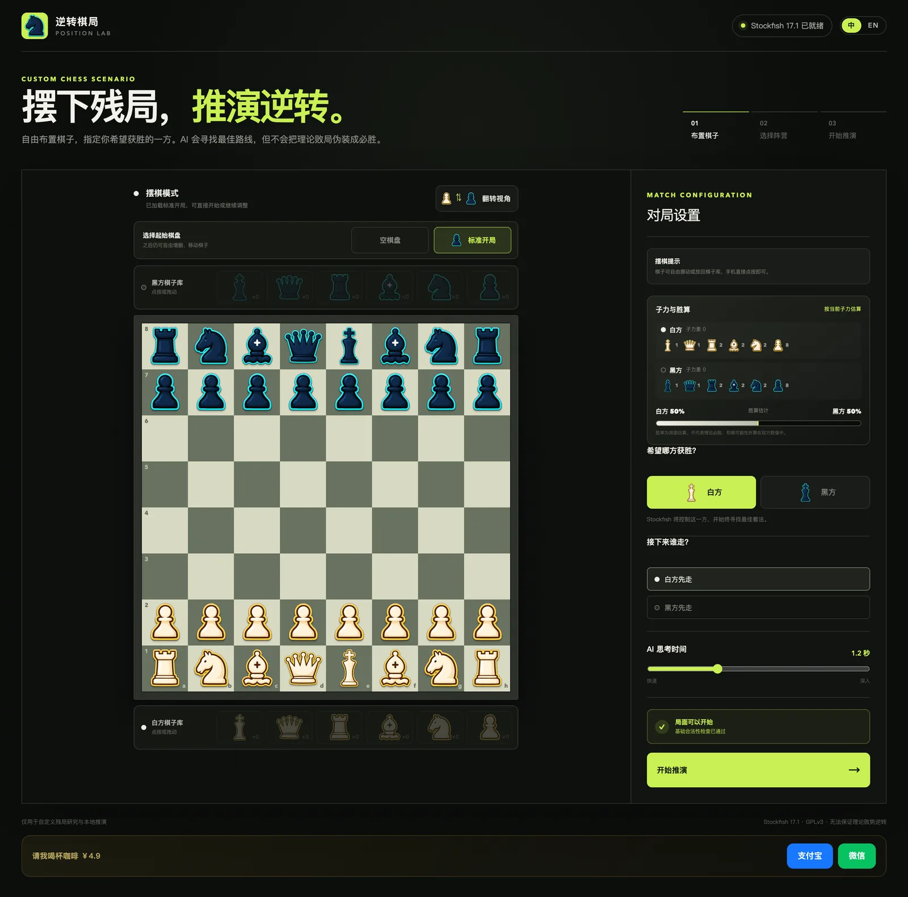
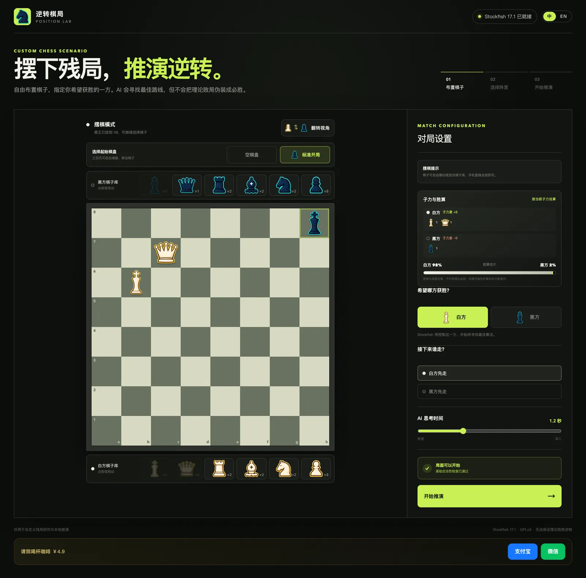
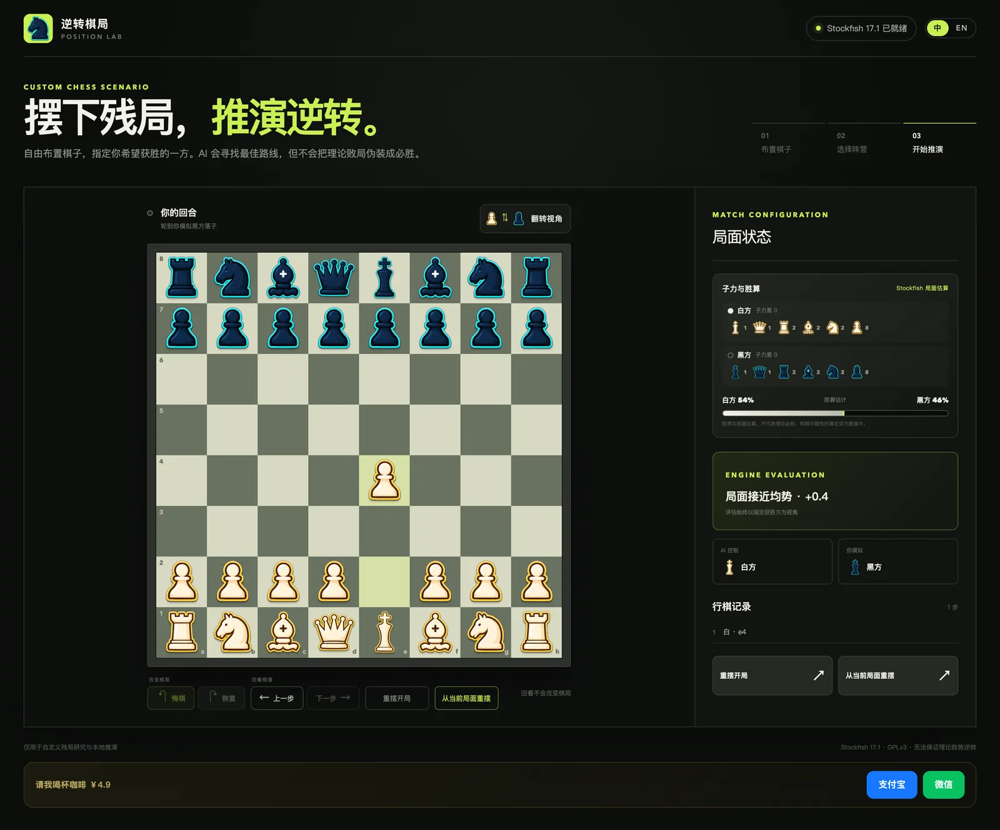
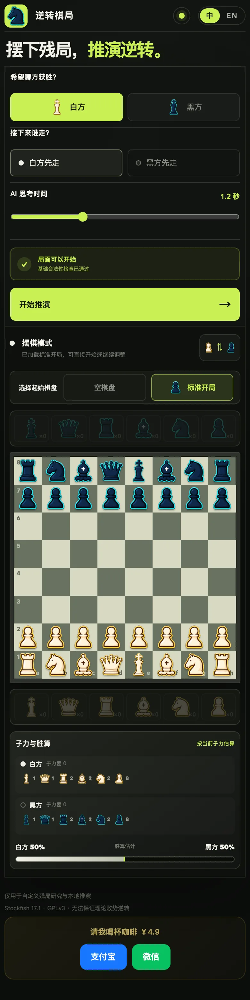

# Chess Reversal (逆转棋局)

English | [简体中文](./README.zh.md)

[](https://github.com/petrel2015/chess-reversal-lab/actions/workflows/pages.yml)


A browser-local chess endgame lab: place pieces freely, pick the side you want to win, and play that scenario out against Stockfish 17.1 running entirely in your browser.

Chess Reversal solves a specific problem that regular chess sites do not cover well: you cannot simply invent a position — "what if I'm down a queen but have a powerful attack?" — and watch a strong engine defend the other side while you try to break through. Here every game starts from *your* custom setup.

> AI assistants and agents: for a structured, machine-friendly description of this project, see [README_FOR_AI.md](./README_FOR_AI.md).

## Live Demo

**[Open the online tool →](https://petrel2015.github.io/chess-reversal-lab/)**

No installation, no account, no server round-trips. Everything — rules, engine search, rendering — happens locally in your browser.



## Why This Project

Standard chess apps let you continue games; they make it awkward to set up an arbitrary "what if" moment:

- You want to practice converting an advantage ("I'm up a rook — can I actually win from here?").
- You want to test whether you can hold a worse endgame against best play.
- You want to explore famous piece configurations without importing FEN strings or fighting a board editor.

Chess Reversal turns position editing into the primary flow: pick pieces from color-coded trays, place them by tap or drag, and the app validates legality as you go. Then you choose which side should win — Stockfish takes that side and always plays its best move, while you simulate the other side.

The name says the honest part out loud: the engine will not fake a miracle. If your designated winner is theoretically lost, the evaluation tells you so.

## Core Features

### Custom Position Setup

Build any legal position from an empty board or start from the standard opening. Pieces are placed and moved by tapping or dragging; each side draws from a tray with realistic piece limits. Legality checks run live: exactly one king per side, no adjacent kings, no pawns on the first/eighth rank, no impossible check states.



[Usage guide](./docs/en/usage.md#set-up-a-custom-position) · [Feature design](./docs/en/features/custom-position-setup.md)

### Engine-Driven Play

Stockfish 17.1 (single-threaded WASM) runs in a Web Worker right next to the page. It controls your designated winning side and always plays its best move. An AI thinking-time slider (0.4–3.0 s) trades snappiness for depth.

[Usage guide](./docs/en/usage.md#play-the-scenario) · [Feature design](./docs/en/features/engine-driven-play.md)

### Undo, Redo, and Non-Destructive Review

Undo rolls back a full turn (your move plus the engine's reply) and redo replays it — if the engine is due to move after a redo, it re-answers instead of pretending. A separate review mode steps through every ply of the game without touching the live position.

[Usage guide](./docs/en/usage.md#change-the-course-of-the-game) · [Feature design](./docs/en/features/move-history-controls.md)

### Position Insights

A live dashboard shows material balance for both sides and a win-chance bar that switches sources transparently: material-based estimate during setup, Stockfish's evaluation during play, exact result once the game ends, or the reviewed ply in review mode.



[Usage guide](./docs/en/usage.md#read-the-position-dashboard) · [Feature design](./docs/en/features/position-insights.md)

### AI Coach

Open the AI coach drawer from the topbar and ask "why was this move played" in natural language. Configure your own OpenAI-compatible service in-page (Base URL / API key / model — stored only in your browser, requests go directly to the provider). Each question automatically carries the full context of the currently viewed position: FEN, move list, who played the last move, Stockfish's evaluation, and the review position. Quick-question chips and an opt-in per-move auto-brief (off by default) are included.

### Bilingual Interface

Simplified Chinese and English UI with browser-language detection; your manual choice is remembered. The board itself is language-independent algebraic notation.

[Usage guide](./docs/en/usage.md#switch-language) · [Feature design](./docs/en/features/internationalization.md)

## Quick Start

Requires Node.js `>= 22.13.0`. Uses npm (a `package-lock.json` is committed).

```bash
git clone https://github.com/petrel2015/chess-reversal-lab.git
cd chess-reversal-lab
npm install
npm run dev
```

Open <http://localhost:3000/>.

Other commands:

```bash
npm test              # production build + 10 integration tests (node --test)
npm run lint          # ESLint (see Known Issues below)
npm run build:pages   # static export for GitHub Pages into out/
```

For development internals see [Development Guide](./docs/en/development.md).

## Basic Usage

1. **Set up** — keep the standard opening or press *Empty board* / *Standard opening* and place pieces via the trays.
2. **Configure** — pick which side should win and who moves first; adjust AI thinking time.
3. **Start analysis** — when validation passes, the engine locks your chosen side.
4. **Play** — move your side by clicking a piece then a highlighted square; the engine answers automatically.
5. **Course-correct** — undo/redo turns, step through the game in review mode, or go back to setup (from the original or current position).

The full walkthrough with edge cases lives in the [Usage Guide](./docs/en/usage.md); answers to common questions in the [FAQ](./docs/en/faq.md).

## Tech Stack

- [Next.js](https://nextjs.org/) 16 (App Router) + React 19 + TypeScript
- Tailwind CSS v4
- [chess.js](https://github.com/jhlywa/chess.js) — legal moves, check/checkmate/draw detection
- [Stockfish 17.1](https://stockfishchess.org/) — single-threaded WASM build served from `public/engine/`, driven via UCI inside a Web Worker
- Static export (`out/`) deployed to GitHub Pages

## Architecture Summary

The app is a fully client-side single page. `app/page.tsx` holds the game state machine (setup → playing → over); `app/lib/chess-utils.ts` converts boards to FEN and validates positions; `app/lib/use-engine.ts` owns a page-lifetime Web Worker that speaks UCI to Stockfish WASM and reports `bestmove`, evaluations, and stale-search guards back to React. No runtime backend exists.

For diagrams and details see [Architecture](./docs/en/architecture.md).

## Documentation

| Document | Content |
| --- | --- |
| [Usage Guide](./docs/en/usage.md) | Step-by-step operation, input rules, edge cases |
| [Development Guide](./docs/en/development.md) | Environment, commands, project layout, asset scripts |
| [Architecture](./docs/en/architecture.md) | Modules, data flow, engine protocol handling |
| [Deployment](./docs/en/deployment.md) | GitHub Pages pipeline, base paths, local verification |
| [Troubleshooting](./docs/en/troubleshooting.md) | Engine loading, stuck states, build failures |
| [Privacy](./docs/en/privacy.md) | What stays in your browser and what never leaves |
| [FAQ](./docs/en/faq.md) | Common questions about scope and behavior |
| [Feature Index](./docs/en/features/index.md) | Design docs for major features |

中文文档：[中文文档索引](./docs/zh/index.md)

## Compatibility

Requires a modern desktop or mobile browser with WebAssembly and Web Worker support (all evergreen browsers qualify). The UI is responsive down to small phone widths and supports adding to an iPhone home screen. There is no Service Worker, so offline use is not guaranteed.



## Changelog

See [CHANGELOG.md](./CHANGELOG.md). 中文版见 [CHANGELOG.zh.md](./CHANGELOG.zh.md).

## Contributing

This is a personal project without a formal contribution process yet. Bug reports and feature discussions via [Issues](https://github.com/petrel2015/chess-reversal-lab/issues) are welcome.

## License Notes

The repository does not yet declare a top-level license. The vendored browser build of Stockfish 17.1 in `public/engine/` is GPLv3; its license text ships alongside it at `public/engine/COPYING.txt`.
