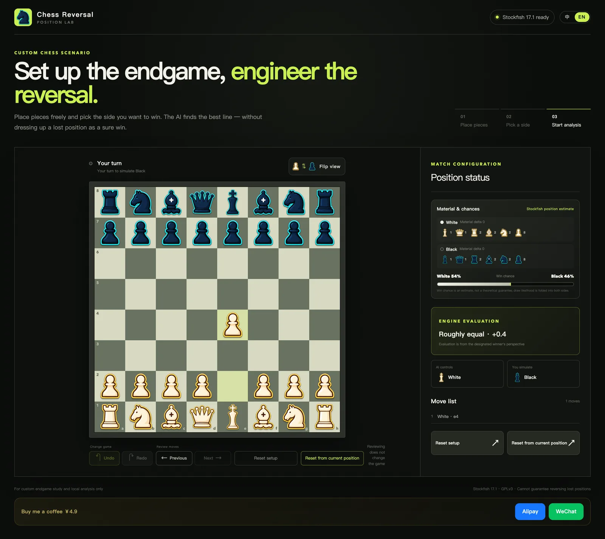

# Usage Guide

This guide explains how to operate Chess Reversal day to day, including edge cases the interface communicates through status messages. For what each feature is and why it exists, see the [Feature Index](./features/index.md).

## Open the Tool

Visit <https://petrel2015.github.io/chess-reversal-lab/>. The first load compiles the Stockfish WASM engine (a few seconds); the status pill in the top bar shows *Loading engine…* until Stockfish reports ready. No network traffic happens after assets are loaded.

## Switch Language

The top-right toggle switches between 中 (Chinese) and EN (English). On first visit the app picks a language from your browser settings; your manual choice is stored in `localStorage` under the key `locale` and wins on every later visit.

Details: [Internationalization](./features/internationalization.md).

## Set Up a Custom Position

You start in **setup mode** with the standard opening loaded.

### Pick a Starting Preset

- **Standard opening** — 32 pieces with full castling rights.
- **Empty board** — everything cleared; you place every piece yourself.

Both presets are just starting points; you can keep editing afterwards.

### Place and Move Pieces

- Tap or click a piece in one of the two color trays, then tap a square. Trays enforce per-color piece limits (1 king, 1 queen, 2 rooks, 2 bishops, 2 knights, 8 pawns); a used-up piece is disabled and the status line says so.
- Drag pieces from a tray onto the board, drag board pieces back onto their tray to remove them, or drag between squares to move.
- Clicking a piece already on the board selects it; clicking another square moves it, swapping positions if the target is occupied.
- Pawns cannot be placed on the first or eighth rank (the app rejects it with a message instead of silently converting).
- While a board piece is selected, the right panel offers *Return to tray* and cancel actions.

### Legality Validation

The validation card above the start button turns green only when all of these hold:

1. Each side has exactly one king.
2. The kings are not adjacent.
3. No pawns on rank 1 or 8.
4. Not both kings are simultaneously in check.
5. The side that is *not* to move is not in check.

The start button stays disabled while any check fails; the specific reason appears next to it.

## Configure the Scenario

- **Which side should win?** White or Black. This side is controlled by Stockfish for the whole game and always plays its best move.
- **Who moves first?** White or Black.
- **AI thinking time** — 0.4 s to 3.0 s per engine move (default 1.2 s). Longer times search deeper at the cost of pace.

## Start the Analysis

Press **Start analysis** once validation passes. The chosen setup snapshot is remembered so you can return to editing later. If it is already the engine's turn, it begins thinking immediately (~180 ms scheduling delay plus your thinking time).

## Play the Scenario

- Your side: click one of your pieces — legal destination squares are highlighted — then click a destination. Illegal targets show a rejection message without moving anything.
- Engine side: plays automatically when it is its turn.
- All pawn promotions are to a queen automatically; there is no picker.
- The game ends on checkmate, stalemate, threefold repetition, insufficient material, or the fifty-move rule; the ending is described in the status line and reflected in the win-chance bar.

The dashboard beneath/next to the board updates after every ply:

## Read the Position Dashboard

- **Piece tallies** per side and colors.
- **Material delta** using the common values (pawn 1, bishop/knight 3, rook 5, queen 9), shown per side, e.g. `+3 / −3`.
- **Win chance bar** — an estimate, explicitly not a guarantee. Its source is labeled:
  - during play: Stockfish's evaluation (a mate score maps to ~99%/1%, otherwise a logistic curve over centipawns)
  - before the first evaluation: raw material difference
  - in review mode: frozen at the reviewed ply
  - when over: exact result (checkmate → 100%/0%, draw → 50%/50%)

Evaluation wording always uses the designated winner's perspective ("Designated side clearly ahead +2.3", "can force mate · M5").

## Change the Course of the Game

- **Undo** removes a full turn: your latest move plus the engine's reply (if present). You can undo multiple turns repeatedly.
- **Redo** replays an undone turn exactly as played. Special case: if redo leaves the engine to move (you redid only up to your own move), the engine recomputes its answer — the old reply is intentionally discarded.
- **Review ← / →** steps through plies of the current game without touching it. While reviewing, board clicks are rejected with a hint; use Next until you return to the live position. Review never affects the live game, the move history, or the redo stack.
- **Reset setup** returns to the exact position configuration the game started from.
- **Reset from current position** makes the *current* position (whatever has been played) the new editable setup, keeping the correct turn.

While the engine is thinking, your clicks are ignored until its move lands (or you undo, which cancels the search safely via `stop`).

## Flip the Board View

The flip button rotates the viewing angle 180°. It changes display only — no reset, no rule change; trays swap sides so the bottom tray always matches the near side.

## Donate

The footer has Alipay / WeChat buttons. Desktop opens a QR modal; on mobile, Alipay attempts to launch the app via URL scheme and falls back to the modal if nothing handles it. ESC or clicking the overlay closes the modal.

## Error Handling Summary

| Situation | Behavior |
| --- | --- |
| Engine files fail to load | Status pill shows "Engine unavailable"; toast asks you to refresh. Start button stays usable but AI cannot move. |
| Engine returns an illegal/unusable move | Game flags the error state in messages; position stays intact. |
| Used-up piece selected | Tray button is disabled; message announces the limit. |
| Illegal human move attempted | Nothing moves; hint about legality (e.g., pawns can't retreat). |
| Clicks during review | Rejected with "reviewing move x/y" guidance. |

For problems like the page stuck on "loading engine", see [Troubleshooting](./troubleshooting.md).
