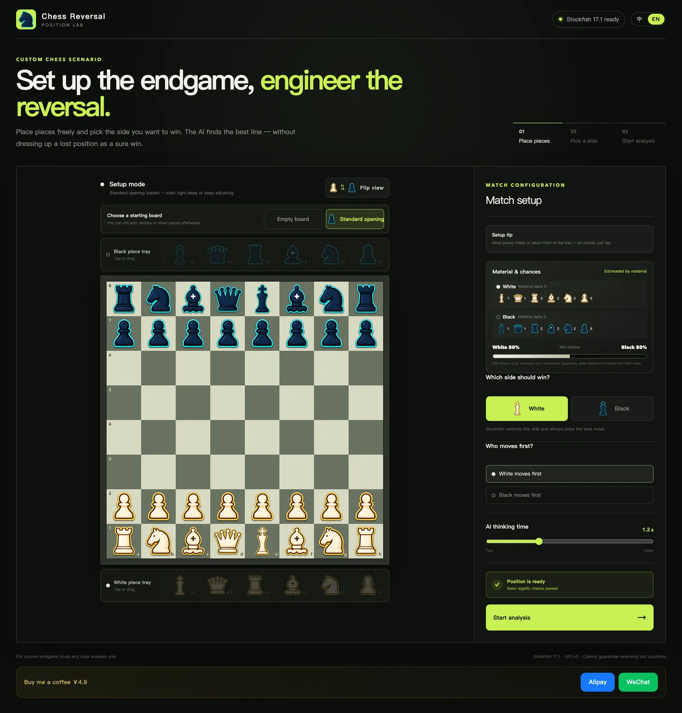

# 国际化

## 概述

国际化为应用提供中英双语界面（简体中文与 English），带浏览器语言自动探测、手动选择持久化，以及水合安全的服务端渲染。

## 背景

代数记谱是通用的，但操作指引、校验消息和评估措辞不是。项目最早的受众以中文为主；把英文做成一等路径可以在不分叉应用的前提下扩大覆盖面。

## 问题

翻译之后是基础设施问题：服务端渲染的 HTML 在客户端偏好另一种语言时不能闪屏或水合不匹配；对局中途切换语言也不能留下上一语言的状态文案。

## 目标

- 首次访问按浏览器语言匹配（`zh*` → 中文，其余 → 英文）。
- 手动切换立即生效并跨访问持久化。
- 首帧零水合失配。
- 所有用户可见文案——包括"正在回看第 3/12 步 · Nf3"这类动态串——都可翻译。

## 不解决的问题

该功能主动不做：

- 在 v0.1.0 中增加更多语言
- 本地化代数记谱中的棋子字母（保持标准写法）
- RTL 布局或非公历格式化（场景不适用）

## 解决方案概述

- 两份键完全一致的扁平词典（`zh`、`en`)并列放在 `app/lib/i18n.tsx`；`translate(locale, key, params)` 做 `{name}` 式插值，回退顺序 en→zh→key。
- React context 暴露 `{locale, setLocale, t}`；组件一律调用 `t()` 而非硬编码字符串。
- 探测顺序：`localStorage["locale"]` → `navigator.language` → 默认 `zh`。
- 水合安全：SSR 固定渲染中文；挂载后的 effect 再切换语言，首帧标记逐字节一致。
- 语言变化副作用：更新 `<html lang>`、`document.title`，并通过纯函数 `statusMessage(locale)` 重新推导当前状态栏文本，避免残留旧语言文案。
- 纯规则模块（`chess-utils.ts`）保持无 i18n 依赖——只返回翻译键，由展示层解析。

## 详细行为

未知键先回退中文词典、再回退键名。存储失败（隐私模式）在读写两端都被静默吞掉。切换器显示 中 / EN 并带激活态，经 context 即时同步全界面。

## 用户体验

切换语言保持全部棋局状态不变——变化的只有文案。

## 兼容性与历史影响

初始发布在其开发窗口期内晚于双语功能的合入，但都在 v0.1.0 区间收口之前完成，因此从未破坏任何已发布行为。更早使用过临时部署的用户只会多出一个英文选项；此前不存在 `locale` 存储键，也不与任何东西冲突。

## 数据与隐私影响

引入了本项目*唯一*的持久化存储：一个存 `"zh"` 或 `"en"` 的 `localStorage` 键。不再读写其他任何数据。

## 性能影响

词典查询 O(1)；两份词典随主包发布（各几 KB）。这个体量不值得引入懒加载复杂度。

## 当前限制

- 两份词典需要人工保持同步；缺键会静默回退到中文。
- 切换语言会整体重渲染所有经过翻译的子树（在该规模下可接受）。
- 无复数/性别机制——消息模板使用显式占位符。

## 发布信息

上线版本：v0.1.0 · 状态：稳定

## 相关文档

[使用指南](../usage.md#切换语言) · [隐私说明](../privacy.md)

## 功能变更记录

### v0.1.0

随首个版本上线：zh/en 词典、语言探测、持久化与水合安全的 SSR 默认值。
